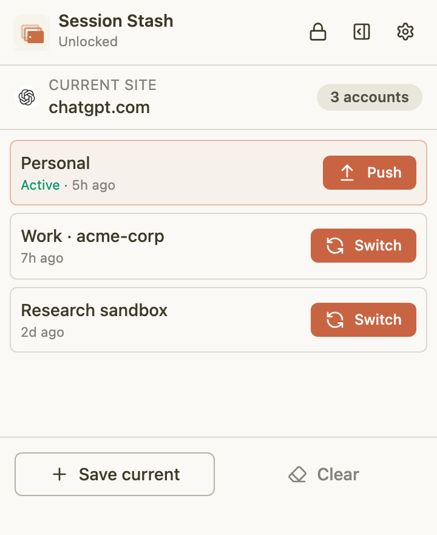
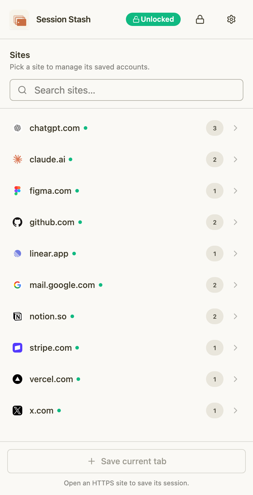
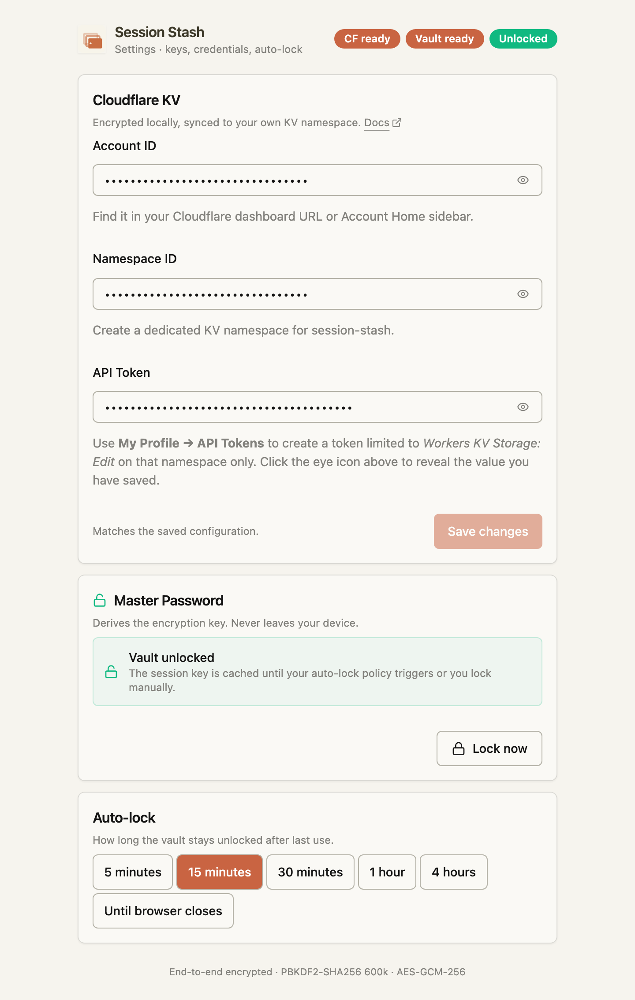

<div align="center">
  

  # Session Stash

  
  

  English | [中文](README_CN.md)

  Session Stash is a Chrome extension for managing multiple account sessions on the same website. Save your cookies and localStorage as encrypted snapshots to your own Cloudflare KV — switch identities without changing browser profiles.

</div>

### Install

Chrome: [Session Stash](https://chromewebstore.google.com/detail/session-stash/) *(coming soon)*

### Features

- Save and switch between multiple account sessions per website
- End-to-end encrypted — AES-GCM-256, key derived via PBKDF2-SHA256 (600k iterations)
- Synced to your own Cloudflare KV namespace — you control the data
- Popup for quick switching, side panel for full management
- Auto-lock vault after configurable idle timeout
- Conflict detection when sessions are updated from another device
- Clear cookies and localStorage for the current site in one click
- Toolbar badge shows the active account

### How It Works

```
┌─────────────┐    snapshot    ┌──────────────┐   encrypt    ┌──────────────────┐
│  Browser Tab │ ──────────▶  │  Background   │ ──────────▶ │  Cloudflare KV   │
│  (cookies +  │              │  Service Worker│              │  (your namespace)│
│  localStorage│ ◀────────── │               │ ◀────────── │                  │
└─────────────┘    inject     └──────────────┘   decrypt    └──────────────────┘
```

1. **Save** — Snapshots cookies and localStorage for the active tab's domain, encrypts them, and writes to KV.
2. **Switch** — Pushes the current session back to KV (if healthy), clears the tab, injects the target session, and reloads.
3. **Push** — Overwrites the cloud version of the active account with the current live session.

> [!NOTE]
> Session Stash operates per-domain — `github.com` and `mail.google.com` maintain separate account lists.

### Screenshots

<table>
  <tr>
    <td align="center" valign="top" width="33%">
      <br>
      <sub><b>Popup</b><br>Quick-switch accounts on the active site.</sub>
    </td>
    <td align="center" valign="top" width="33%">
      <br>
      <sub><b>Side panel</b><br>Search across all saved sites.</sub>
    </td>
    <td align="center" valign="top" width="33%">
      <br>
      <sub><b>Settings</b><br>Cloudflare keys, master password, auto-lock.</sub>
    </td>
  </tr>
</table>

### Usage

1. Install the extension and click the Session Stash icon → **Settings**
2. Enter your Cloudflare **Account ID**, **Namespace ID**, and **API Token**
3. Set a master password — this encrypts all session data before it leaves the browser
4. Navigate to any HTTPS site, click the icon, and **Save current** to capture your session
5. Log into a different account on the same site and save it with a different label
6. Switch between accounts with one click — the tab reloads with the new identity

> [!TIP]
> Create your Cloudflare KV namespace at **Workers & Pages → KV** in the [Cloudflare dashboard](https://dash.cloudflare.com/). You'll need an API token with `Account.Workers KV Storage` read/write permission.

### Privacy

- Your master password never leaves the browser
- All session data is encrypted locally before being sent to Cloudflare KV
- No telemetry, no analytics, no third-party services
