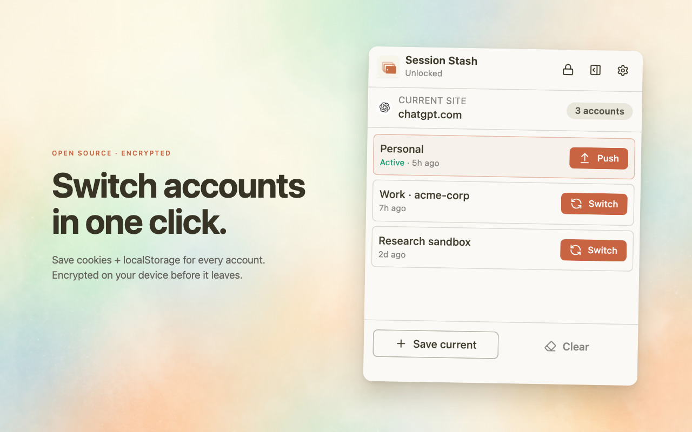
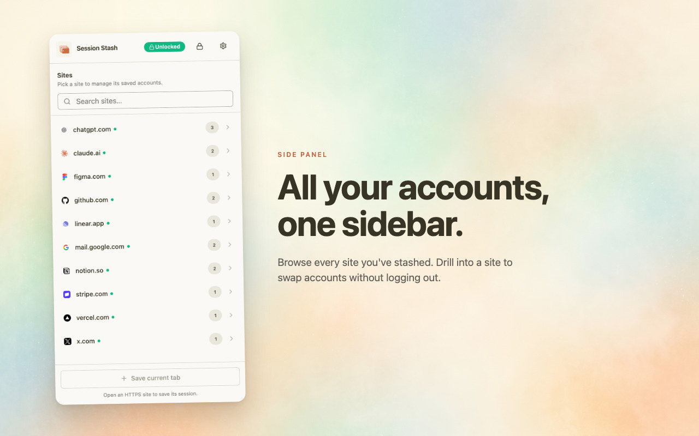
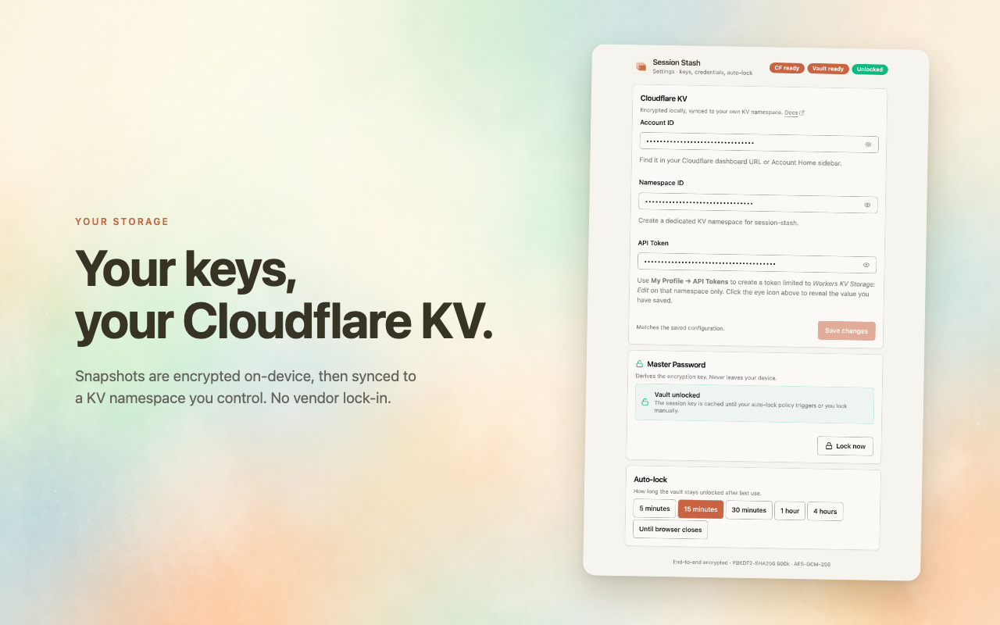

<div align="center">
  

# Session Stash


[English](README.md) | 中文

Session Stash 是一个 Chrome 扩展，用于管理同一网站上的多个账号会话。将 Cookie 和 localStorage 作为加密快照保存到你自己的 Cloudflare KV — 无需切换浏览器配置文件即可切换身份。

</div>

### 安装

Chrome：[Session Stash](https://chromewebstore.google.com/detail/session-stash/kfbdilhallcofbmjjlhlchehkcbnailc)

### 功能

- 在同一网站上保存和切换多个账号会话
- 端到端加密 — AES-GCM-256，密钥通过 PBKDF2-SHA256（60 万次迭代）派生
- 同步到你自己的 Cloudflare KV 命名空间 — 数据完全由你掌控
- 弹窗快速切换，侧边栏完整管理
- 可配置空闲超时后自动锁定
- 多设备更新时的冲突检测
- 一键清除当前网站的 Cookie 和 localStorage
- 工具栏徽标显示当前活跃账号

### 工作原理

```
┌─────────────┐     快照     ┌──────────────┐    加密     ┌──────────────────┐
│  浏览器标签页 │ ──────────▶ │  Background   │ ──────────▶ │  Cloudflare KV   │
│  (Cookie +   │             │  Service Worker│             │  (你的命名空间)   │
│  localStorage│ ◀────────── │               │ ◀────────── │                  │
└─────────────┘     注入     └──────────────┘    解密     └──────────────────┘
```

1. **保存** — 抓取当前标签页域名的 Cookie 和 localStorage 快照，加密后写入 KV。
2. **切换** — 将当前会话推送回 KV（如果健康），清除标签页数据，注入目标会话，重新加载。
3. **推送** — 用当前浏览器中的实时会话覆盖云端已保存的版本。

> [!NOTE]
> Session Stash 按域名隔离 — `github.com` 和 `mail.google.com` 各自维护独立的账号列表。

### 截图

<p align="center">
  <br>
  <br>
  
</p>

### 使用方法

1. 安装扩展后点击 Session Stash 图标 → **Settings**
2. 输入你的 Cloudflare **Account ID**、**Namespace ID** 和 **API Token**
3. 设置主密码 — 所有会话数据在离开浏览器前都会被加密
4. 打开任意 HTTPS 网站，点击图标，**Save current** 保存当前会话
5. 在同一网站登录另一个账号，用不同的标签保存
6. 一键切换账号 — 标签页会以新身份重新加载

> [!TIP]
> 在 [Cloudflare 控制台](https://dash.cloudflare.com/) 的 **Workers & Pages → KV** 中创建命名空间。API Token 需要 `Account.Workers KV Storage` 读写权限。

### 隐私

- 主密码永远不会离开浏览器
- 所有会话数据在发送到 Cloudflare KV 之前都在本地加密
- 无遥测、无分析、无第三方服务
